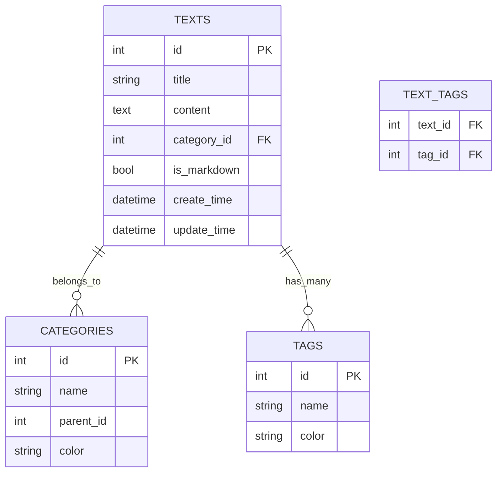

# 高级文本管理工具 v6.4 使用说明书

## 作者：杜玛
## 版权永久所有 ©2025
## 技术支持：[GitHub](https://github.com/duma520)

---

## 目录

1. [简介](#简介)
2. [快速入门](#快速入门)
3. [核心功能](#核心功能)
4. [高级功能](#高级功能)
5. [技术细节](#技术细节)
6. [常见问题](#常见问题)
7. [附录](#附录)

---

## 1. 简介 <a name="简介"></a>

### 1.1 什么是高级文本管理工具？

高级文本管理工具是一款功能强大的个人知识管理软件，专为需要高效组织和检索大量文本内容的用户设计。它结合了数据库管理、全文搜索、分类标签系统和Markdown支持等多项功能。

### 1.2 适用人群

- **学生**：管理学习笔记、论文资料
- **作家/记者**：整理写作素材、草稿
- **程序员**：保存代码片段、技术文档
- **研究人员**：组织文献资料、研究笔记
- **企业用户**：管理产品文档、会议记录

### 1.3 主要特点

- **多格式支持**：纯文本和Markdown格式
- **智能搜索**：支持拼音首字母搜索和全文检索
- **分类标签**：多级分类和标签系统
- **回收站**：防止误删重要内容
- **数据分析**：文本统计和相似性分析
- **批量操作**：高效处理大量文本

---

## 2. 快速入门 <a name="快速入门"></a>

### 2.1 安装与启动

1. 确保已安装Python 3.7+
2. 安装依赖库：`pip install PyQt5 pypinyin markdown`
3. 运行程序：`python Text_Manager.py`

### 2.2 界面概览

![界面示意图]
```
左侧面板：
- 分类树
- 搜索框
- 文本列表

右侧面板：
- 编辑区（顶部）
- 预览区（底部）
```

### 2.3 基础操作

**创建新文本**：
1. 点击"新建"按钮或按Ctrl+N
2. 输入标题和内容
3. 点击"保存"或按Ctrl+S

**搜索文本**：
1. 在搜索框输入关键词
2. 支持拼音首字母（如"wzgl"可搜索"文章管理"）

---

## 3. 核心功能 <a name="核心功能"></a>

### 3.1 文本管理

#### 3.1.1 基本操作
| 操作 | 方法 | 快捷键 |
|------|------|--------|
| 新建 | 点击"新建"按钮 | Ctrl+N |
| 保存 | 点击"保存"按钮 | Ctrl+S |
| 删除 | 点击"删除"按钮 | Del |

#### 3.1.2 格式切换
- **纯文本模式**：适合简单笔记
- **Markdown模式**：支持丰富格式（标题、列表、链接等）

*示例：Markdown语法*
```markdown
# 一级标题
## 二级标题
- 列表项
**加粗** *斜体*
```

### 3.2 分类系统

#### 3.2.1 创建分类
1. 通过"分类"菜单→"新建分类"
2. 支持多级分类（拖拽调整层级）

#### 3.2.2 分类颜色
- 右键分类→"设置颜色"可自定义显示颜色

### 3.3 标签系统

#### 3.3.1 添加标签
- 在标签输入框用逗号分隔多个标签
- 支持自动提取关键词作为标签

#### 3.3.2 标签筛选
- 从标签下拉框选择标签快速筛选内容

---

## 4. 高级功能 <a name="高级功能"></a>

### 4.1 高级搜索

![高级搜索面板]
```
包含功能：
- 日期范围筛选
- 字数统计筛选
- 全文检索模式
```

### 4.2 批量操作

**典型场景**：
1. 批量修改分类
2. 批量添加标签
3. 批量导出文件

*操作步骤*：
1. 在列表中选择多个文本（Ctrl+点击多选）
2. 点击"批量操作"按钮
3. 选择要执行的操作

### 4.3 文本分析

**包含功能**：
- 字数统计图表
- 关键词提取
- 相似文本推荐

*示例分析报告*：
```
字数统计：
- 总字数：1250
- 中文字符：800
- 英文单词：450

关键词：
研究, 数据, 分析

相似文本：
1. 数据分析方法 (相似度85%)
2. 研究笔记 (相似度72%)
```

### 4.4 回收站管理

- 删除的内容会进入回收站
- 支持永久删除或恢复
- 切换视图快捷键：Ctrl+Shift+R

---

## 5. 技术细节 <a name="技术细节"></a>

### 5.1 数据库结构



### 5.2 搜索算法

**拼音搜索原理**：
```python
def get_pinyin_query(text):
    result = []
    for char in text:
        if is_chinese(char):  # 中文字符
            pinyin = convert_to_pinyin(char)
            result.append(pinyin[0])  # 取首字母
        else:
            result.append(char)
    return ''.join(result)
```

**全文检索**：
- 基于SQLite FTS5引擎
- 支持porter词干提取
- 支持unicode61分词

### 5.3 性能优化

1. **WAL模式**：提高并发读写性能
2. **自动缓存**：频繁访问数据缓存
3. **延迟加载**：大数据集分批加载

---

## 6. 常见问题 <a name="常见问题"></a>

### Q1: 数据存储在哪里？
A: 所有数据存储在`text_manager_enhanced.db`SQLite数据库中

### Q2: 如何备份数据？
A: 直接复制数据库文件即可完成备份

### Q3: 支持云同步吗？
A: 可将数据库文件放入云同步目录（如Dropbox）实现同步

### Q4: 最大支持多少文本？
A: 理论上支持数百万条，实际性能取决于硬件配置

### Q5: 如何导入旧数据？
A: 使用"文件→导入"功能或直接操作数据库

---

## 7. 附录 <a name="附录"></a>

### 7.1 快捷键大全

| 功能 | 快捷键 |
|------|--------|
| 保存 | Ctrl+S |
| 新建 | Ctrl+N |
| 删除 | Del |
| 搜索 | Ctrl+F |
| 预览 | Ctrl+P |
| 回收站 | Ctrl+Shift+R |

### 7.2 推荐工作流

**学术研究场景**：
1. 按课题创建分类
2. 使用标签标记"文献"、"笔记"、"数据"
3. 定期使用分析功能整理思路

**写作场景**：
1. 用Markdown写作
2. 用分类管理章节
3. 用标签标记"初稿"、"修改"、"完成"

### 7.3 技术支持

所有技术支持通过[GitHub Issues](https://github.com/duma520)公开进行

---

*说明书版本：v6.4.2025*
*最后更新：2025年5月6日*
